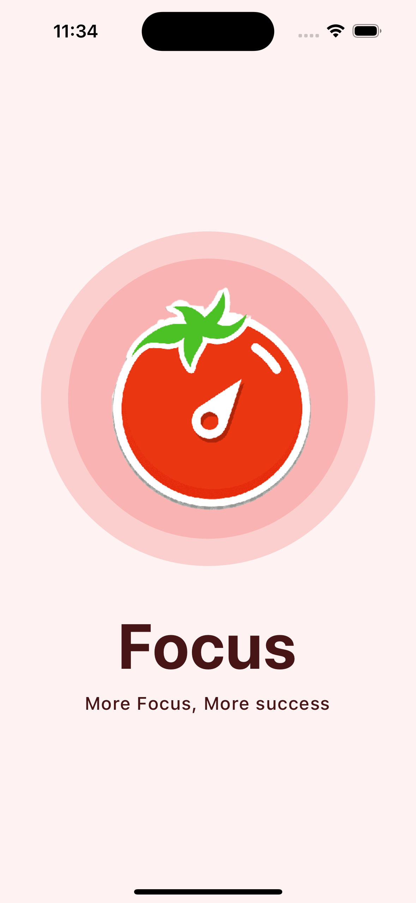
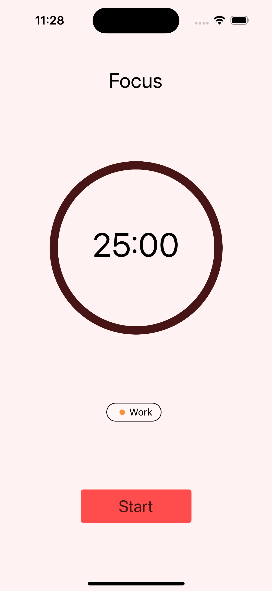
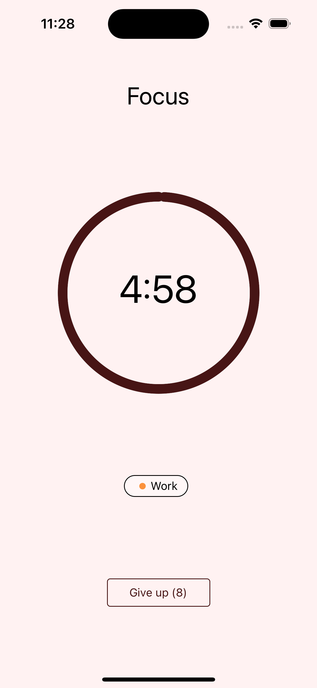

# React Native Promodoro Counter App

<table>
  <tr>
    <td valign="top"></td>
    <td valign="top"></td>
  </tr>
  <tr>
    <td valign="top"></td>
    <td valign="top"></td>
  </tr>
</table>

## Get Started

Node version

### `v16`

install dev dependencies

### `npm install` or `yarn install`

## Then

Run The app

### `npm start` or `yarn start`